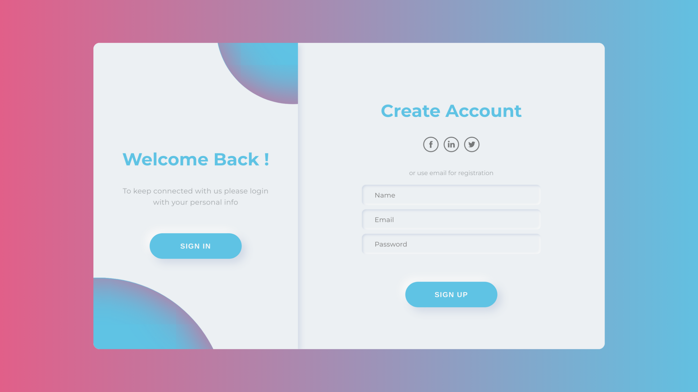

# Neumorphism Login and Registration

This is a responsive login and registration form built using HTML, CSS, and JavaScript, with a Neumorphism design style.

## Features

* Neumorphism design style
* Responsive layout
* Login and registration forms
* Form validation using JavaScript

## Demo

You can see a live demo of the project [here](https://karthik-beta.github.io/Responsive-Login-Registration-Form)

## Getting Started

To get started, you can simply clone this repository and open the index.html file in your browser.

git clone : `https://github.com/Karthik-beta/Responsive-Login-Registration-Form.git`

## Usage

The project consists of three files:

* `index.html`: The main HTML file that contains the login and registration forms
* `style.css`: The CSS file that contains the styles for the forms and the Neumorphism design
* `script.js`: The JavaScript file that contains the form validation logic

You can modify the HTML, CSS, and JavaScript files to customize the design and functionality of the forms.

## Acknowledgments

This project was inspired by the Neumorphism design trend, and it was built as a fun exercise to practice HTML, CSS, and JavaScript skills.

## Contributing

Contributions are welcome! If you find a bug or want to add a new feature, please open an issue or a pull request.

## License

This project is licensed under the MIT License. See the LICENSE file for more information.
